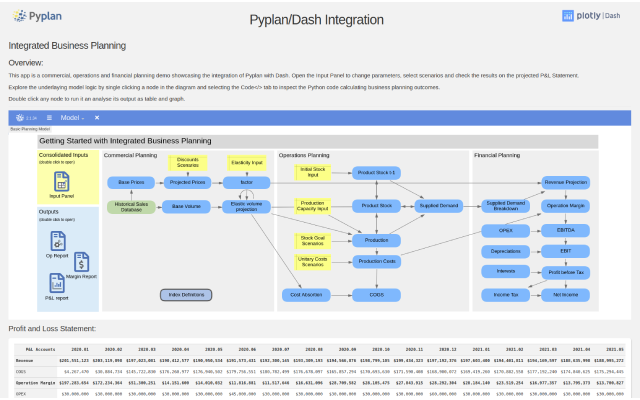

# Pyplan/Dash Integration demo

## Overview

This app is a commercial, operations and financial planning demo showcasing the integration of Pyplan with Dash.  Open the Input Panel to change parameters, select scenarios and check the results on the projected P&L Statement.

Explore the underlaying model logic by single clicking a node in the diagram and selecting the Code</> tab to inspect the Python code calculating business planning outcomes.
Double click any node to run it an analyse its output as table and graph.



## Run it locally

### Requirements

```bash
python -m venv venv
. venv/bin/activate
pip install --upgrade pip
pip install -r requirements.txt
```

### Run

```bash
. venv/bin/activate
python app.py
```
